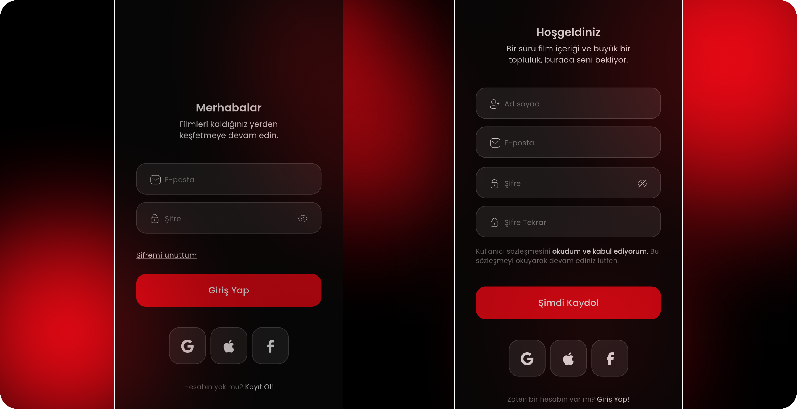
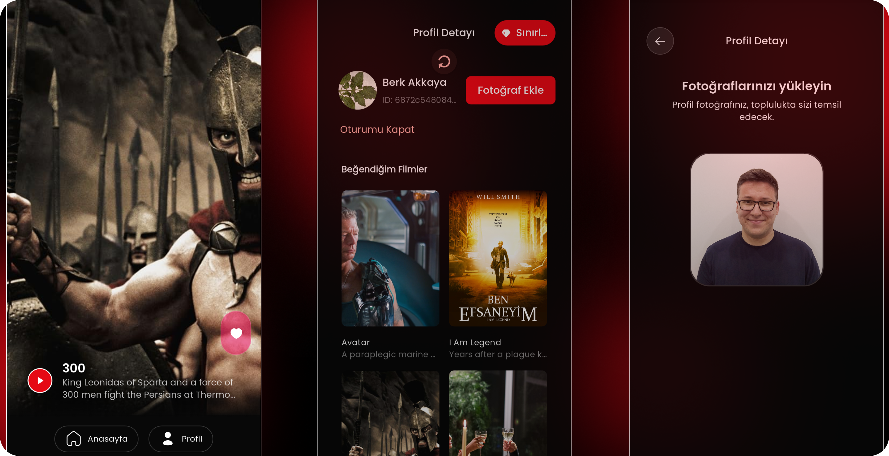
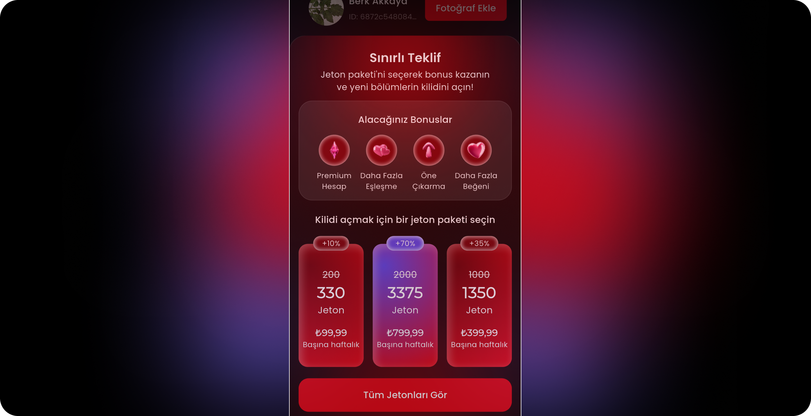

# SinFlix - Case Study Dating Movie App

A feature-rich Flutter mobile application that mimics a movie based dating platform,
developed as a case study for Nodelabs. SinFlix offers a seamless movie browsing
experience with user authentication, profile management, and personalized favorites.


## 📱 Features

- **Authentication System**
  - User registration (sign up)
  - User login (sign in)
  - Profile management
  - Auto routing based off of user's auth status

- **Movie Discovery Tab**
  - Browse through a collection of movies
  - Dynamic loading of movie data
  - Beautiful UI with movie posters and endless scrolling

- **User Profile Tab**
  - Personalized user profile view
  - View favorite movies
  - Pull-to-refresh functionality
  - Profile picture upload

- **Limited Time Offers**
  - Special promotional popups
  - Timed exclusive deals

- **Extra Features**
  - Custom theming and animations for the like button's "liked" state
  - Logger and logging service implementations
  - Firebase Crashlytics and Analytics integrations
  - Secure token storage through OS shared preferences layer
  - Splash screen and app icon configurations

## 🧰 Tech Stack

- **Framework**: Flutter
- **State Management**: 
  - BLoC (Business Logic Component) pattern using flutter_bloc
  - Clean Architecture & MVVM implementation
  
- **Backend & Services**:
  - Firebase Core
  - Firebase Analytics
  - Firebase Crashlytics
  
- **Networking**:
  - Dio for API requests
  - REST API integration
  
- **Data Persistence**:
  - Shared Preferences for local storage
  - Caching mechanisms for images and data
  
- **UI/UX**:
  - Custom icon fonts
  - Cached network images for performance
  - Google Fonts integration
  - Flutter Inner Shadow for advanced styling
  
- **Debugging & Logging**:
  - Talker Flutter for advanced logging
  - Talker Dio Logger for HTTP request logging
  - Talker BLoC Logger for state management debugging

## 🏗️ Project Architecture

The project follows a Clean Architecture approach with feature-based organization:

```
lib/
├── core/                  # Core utilities, constants, and shared resources
│   ├── consts/            # App-wide constants (colors, themes, etc.)
│   ├── services/          # Core services (API, logging, storage)
│   └── widgets/           # Shared widgets used across features
│
├── features/              # Feature modules
│   ├── auth/              # Authentication feature
│   ├── home_discover_tab/ # Movie discovery tab
│   ├── home_profile_tab/  # User profile tab
│   ├── home_screen/       # Main screen container
│   └── limited_offer_popup/ # Promotional offers feature
│
└── main.dart              # Application entry point
```

Each feature follows the Clean Architecture pattern with:
- **Presentation**: Widgets, BLoCs, Events, States
- **Domain**: Use Cases, Entities, Repository Interfaces
- **Data**: Repositories, Data Sources

## 🚀 Getting Started

### Prerequisites
- Flutter SDK (^3.8.1)
- Dart SDK
- Android Studio / VS Code
- A physical device or emulator

### Installation

1. Clone the repository:
   ```
   git clone https://github.com/berkakkaya/nodelabs_caseapp_sinflix.git
   ```

2. Navigate to the project directory:
   ```
   cd nodelabs_caseapp_sinflix
   ```

3. Install dependencies:
   ```
   flutter pub get
   ```

4. Run the app:
   ```
   flutter run
   ```

## 🔧 Configuration

This project uses Firebase services. To configure the app with your own Firebase project:

1. Create a Firebase project at [firebase.google.com](https://firebase.google.com)
2. Register your app (Android/iOS)
3. Download the configuration files (`google-services.json` for Android, `GoogleService-Info.plist` for iOS)
4. Place these files in their respective locations
5. Update the Firebase options in the `firebase_options.dart` file

## 🎨 Design & UI

SinFlix features a modern, intuitive UI with:
- Dark theme optimized for content viewing.
- Custom icons and animations.
- Responsive layouts for various device sizes.
- Stunning layout, designed to be pixel-perfect.







## 📝 License

This project is intended as a case study and demonstration of Flutter development skills.

## 🙏 Acknowledgements

- [Flutter](https://flutter.dev/)
- [Bloc Library](https://bloclibrary.dev/)
- [Firebase](https://firebase.google.com/)
- [Nodelabs](https://nodelabs.software/) for the opportunity

---

*Developed with ❤️ by [Berk Akkaya](https://github.com/berkakkaya) - July 2025*

- **LinkedIn:** https://www.linkedin.com/in/berk-akkaya/
- **GitHub:** https://github.com/berkakkaya

📧 [berkakkaya000@gmail.com](mailto:berkakkaya000@gmail.com) | 📞 [+90 505 417 4826](phone:+905054174826)
